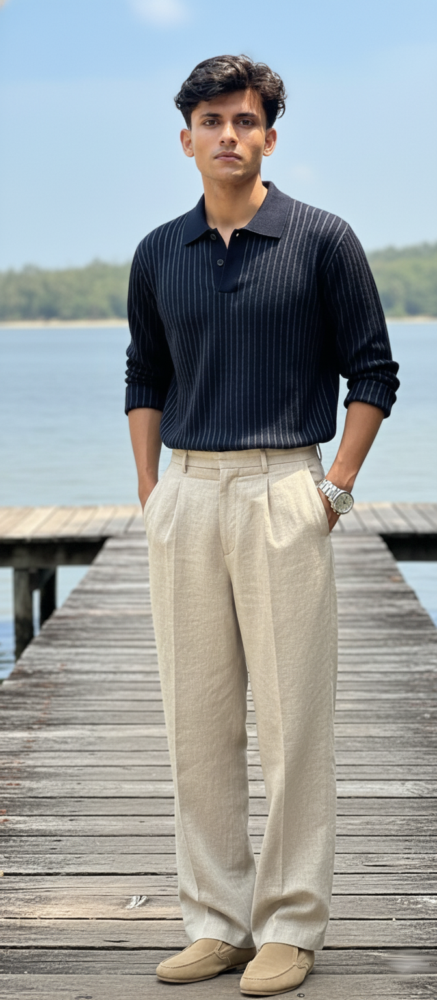

<html lang="en">
<head>
  <meta charset="UTF-8" />
  <meta name="viewport" content="width=device-width, initial-scale=1.0" />
  <title>My Portfolio</title>
  
</head>
<body>
  <header>
    
    <h1>Muhammed Noufal</h1>
    
IT Developer • Designer • Traveler

  </header>

  <nav>
    <a href="#about">About</a>
    <a href="#projects">Projects</a>
    <a href="#travel">Travel</a>
    <a href="#contact">Contact</a>
  </nav>

  <section id="about">
    <h2>About Me</h2>
    

      
      

        

          Hi! I'm <b>Muhammed Noufal</b>, a passionate IT developer who loves building
          beautiful and functional websites. I enjoy creating modern designs, learning new technologies, and exploring the world through travel and photography.
        

      

    

  </section>

  <section id="projects">
    <h2>My Projects</h2>
    

      

        
        

           <h3><a href="skills">Portfolio Website</a></h3>
          
A personal website showcasing my skills and projects.

        

      

      

        
        

          <h3>Travel Blog</h3>
          
Sharing my adventures, tips, and travel photography.

        

      

      

        
        

          <h3>Passion for Sports</h3>
          
Staying active through games that build focus, teamwork, and strategy.

        

      

    

  </section>

  <section id="travel">
    <h2>Travel Gallery</h2>
    

      
      
      
      
    

  </section>

  <section id="contact">
    <h2>Contact Me</h2>
    

      
Feel free to reach out via email or follow me on social media!

      

        <a href="#"><svg xmlns="http://www.w3.org/2000/svg" viewBox="0 0 30 30"><path d="M9.998 3C6.139 3 3 6.142 3 10.002v10c0 3.859 3.142 7 7.002 7h10c3.86 0 7-3.142 7-7.002v-10c0-3.86-3.142-7-7.002-7h-10zM22 7a1 1 0 110 2 1 1 0 010-2zm-7 2a6 6 0 100 12 6 6 0 000-12z"/></svg></a>
        <a href="#"><svg xmlns="http://www.w3.org/2000/svg" viewBox="0 0 512 512"><path d="M459.37 151.716c..."/></svg></a>
        <a href="#"><svg xmlns="http://www.w3.org/2000/svg" viewBox="0 0 640 512"><path d="M524.531,69.836a1.5,1.5..."/></svg></a>
      

    

  </section>

  <footer>
    © 2025 Noufal. All rights reserved.
  </footer>
</body>
</html>
